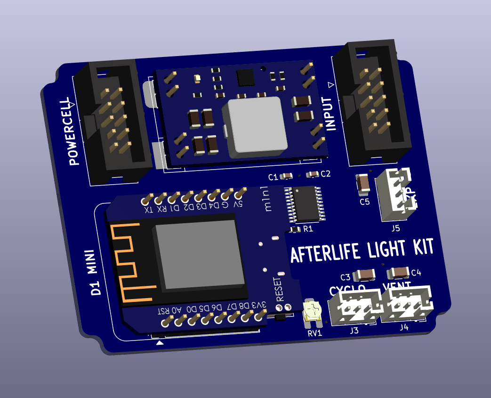
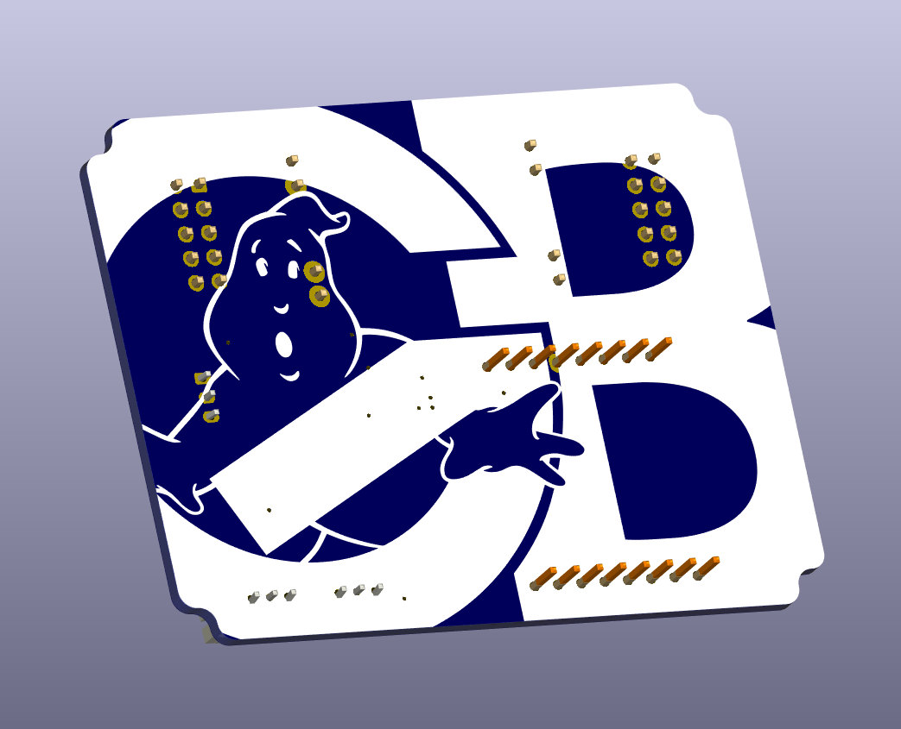

# Afterlife Light Kit
This is the code repository for the Afterlife Light Kit, coming soon!

## Project Goals / Roadmap
- [ ] Recreate Cyclotron effect from Ghostbusters: Afterlife.
- [ ] Powercell LED bar graph.
- [ ] Number of LEDs for each light output should be configurable so smaller LED rings can be used for smaller packs.
- [ ] Configurable Cyclotron direction (Clockwise/Anticlockwise)
- [ ] Vent light LED ring.
- [ ] Color changing for Ghostbusters: The Video Game modes.
- [ ] Broadcast access point with DNS so the device can be accessed via a hostname (`gbfans.com`?).
- [ ] Settings can be configured via a web interface.
- [ ] Firmware can be updated via a web interface or over serial.
- [ ] Special modes accessible via web interface, test mode and party mode (rainbow, or other animations).
- [ ] Ability to select preferred animations for each Video Game mode. Switch between 1984 animation and Afterlife animations. Enable or disable start up / shut down animations.

## Hardware Pin Configuration
|    Pin    | Description |
| --------- | ----------- |
| `A0 / ADC0` | Potentiometer Input (for adjusting the speed of animations, or other function) |
| `D0 / GPIO16` | Fire Trigger (Input Active Low) |
| `D1 / GPIO5` | Cyclotron Light Data Out |
| `D2 / GPIO4` | Vent Light Data Out |
| `D3 / GPIO0` | Powercell Light Data Out |
| `D4 / GPIO2` | Unused |
| `D5 / GPIO14` | Change Trigger (Input Active Low, for video game mode changes) |
| `D6 / GPIO12` | Vent Trigger (Input Active Low) |
| `D7 / GPIO13` | Enable Trigger (Input Active Low, for turning on the lights) |
| `D8 / GPIO15` | Shift Enable (Output Active High, for turning on the logic shifter) |

## Lightmodes

All of these modes should be able to be changed for a custom setup, though an easy to select pre-set should be available as outlined below:

**Standard 1984 Mode:** Lights snap to specific positions and speeds are constant.
 - Can select between white and red for Cyclotron and white and blue for power cell.

**Video Game Mode** - Additional animations on by default as well as selecting between video game modes.
 - Cyclotron can fade in and out (if this was accurate to the video game).
 - Animations should be similar to what was used in the video game.

**Afterlife Mode** - Recreating the spinning Cyclotron animation from Ghostbusters: Afterlife as well as some powercell animations.

## Custom Light Settings

There should be several animations and styles to choose between. All of these can be mixed and matched for any custom combination.

### Start Up Animations

- Power cell can select between no start up animations or 1 or 2 styles of animation.
- Cyclotron can select between no start up animations or slow spin up or fast spin up.
- Vent light can have options to do nothing or perhaps emit a start up glow?

### Color Selections

- Power cell should have the option to select any color with defaults being Blue and White (or warm white if available). Rainbow mode and potentially other patterns should be available. Each video game mode should allow the selection of a non-standard color.
- Cyclotron should have the ability to select any color with the default being red. Each video game mode should allow for the selection of a specific color for each mode. (Green for slime, blue for statis, yellow for meson, pink/purple for boson).
- Vent should have the ability to select between any color with the default being white.

### Cyclotron Animations

- The cyclotron should have many different selectable animations. Static snap on / off for each light, lights fade between each position, Afterlife mode with spinning.
- The direction the lights rotate should be selectable (Clockwise/Anticlockwise).
- Video game mode should have many more animation styles. Idea: Green Slime mode has effect that looks like the cyclotron is filled with slime sloshing.
- Ability to set other preset animations, rainbow chase, Pac-Man or other creative ideas.

### Vent Animations

- Several choices should likely be available between strobing lights, spinning chase effect.. etc.

# License

This program is free software: you can redistribute it and/or modify it under the terms of the GNU General Public License as published by the Free Software Foundation, either version 3 of the License, or (at your option) any later version.

This program is distributed in the hope that it will be useful, but WITHOUT ANY WARRANTY; without even the implied warranty of MERCHANTABILITY or FITNESS FOR A PARTICULAR PURPOSE. See the GNU General Public License for more details.

You should have received a copy of the GNU General Public License along with this program. If not, see <https://www.gnu.org/licenses/>.
